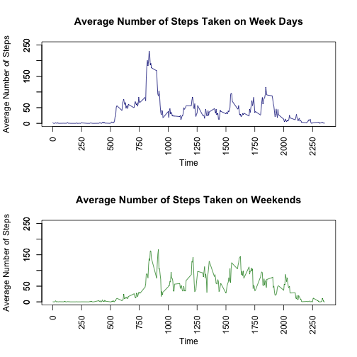

# Reproducible Research - Peer Assessment 1
## Introduction
It is now possible to collect a large amount of data about personal movement using activity monitoring devices such as a Fitbit, Nike Fuelband, or Jawbone Up. These type of devices are part of the “quantified self” movement – a group of enthusiasts who take measurements about themselves regularly to improve their health, to find patterns in their behavior, or because they are tech geeks. But these data remain under-utilized both because the raw data are hard to obtain and there is a lack of statistical methods and software for processing and interpreting the data.

This assignment makes use of data from a personal activity monitoring device. This device collects data at 5 minute intervals through out the day. The data consists of two months of data from an anonymous individual collected during the months of October and November, 2012 and include the number of steps taken in 5 minute intervals each day.

### Loading and preprocessing the data
*Ensure the activity monitoring dataset is in the working directory*

Read in the activity monitoring dataset

```r
ds <- "activity.csv"
amd <- read.csv(ds, colClasses = c("numeric", "Date", "numeric"))
summary(amd)
```

```
##      steps             date               interval     
##  Min.   :  0.00   Min.   :2012-10-01   Min.   :   0.0  
##  1st Qu.:  0.00   1st Qu.:2012-10-16   1st Qu.: 588.8  
##  Median :  0.00   Median :2012-10-31   Median :1177.5  
##  Mean   : 37.38   Mean   :2012-10-31   Mean   :1177.5  
##  3rd Qu.: 12.00   3rd Qu.:2012-11-15   3rd Qu.:1766.2  
##  Max.   :806.00   Max.   :2012-11-30   Max.   :2355.0  
##  NA's   :2304
```

### What is the mean total number of steps taken per day?
The total number of steps taken per day are:

```r
amd.total <- sum(amd$steps, na.rm = TRUE)
print(amd.total)
```

```
## [1] 570608
```

Here is a histogram showing the total number of steps taken each day

```r
amd.steps.agg <- aggregate(amd$steps, by=list(amd$date), sum)
names(amd.steps.agg) <- c("date", "steps")
hist(amd.steps.agg$steps, 
     col = "red", 
     main = "Total Number of Steps per Day", 
     xlab = "Steps",
     breaks = 30)
```

 

```r
options(scipen = 1, digits = 2)
amd.mean.perday <- mean(amd.steps.agg$steps, na.rm =  TRUE)
amd.median.perday <- median(amd.steps.agg$steps, na.rm = TRUE)
```

The mean and median of the total number of steps taken per day are:

* mean: 10766.19
* median: 10765

### What is the average daily activity pattern?
The following time series plot shows at 5-minute intervals the average number of steps taken, averaged across all days

```r
amd.ts <- aggregate(cbind(steps) ~ interval, data = amd, FUN = mean, na.rm = TRUE)
plot(amd.ts$interval, 
     amd.ts$steps, 
     type = "l", 
     xlab = "Time",
     ylab = "Average Number of Steps",
     main = "Average Number of Steps Taken Across All Days")
```

 


```r
amd.max <- which.max(amd.ts$steps)
amd.max.highestInterval <- amd.ts[amd.max,]$interval
print(amd.max.highestInterval)
```

```
## [1] 835
```

The 5-minute interval containing the maximum number of steps is 835

### Imputing missing values
The total number of rows with NA values are:

```r
amd.na.count <- length(which(is.na(amd)))
print(amd.na.count)
```

```
## [1] 2304
```

The following strategy fills in the missing values in the dataset using the mean for that 5-minute interval creating a dataset equal to the original dataset but with the missing data filled in

```r
amd.merge.interval <- merge(amd, amd.ts, by="interval")
amd.na <- is.na(amd.merge.interval$steps.x)
amd.merge.interval$steps.x[amd.na] <- amd.merge.interval$steps.y[amd.na]
amd.filledIn <- subset(amd.merge.interval, select = c("interval", "steps.x", "date"))
names(amd.filledIn) <- c("interval", "steps", "date")
head(amd.filledIn)
```

```
##   interval steps       date
## 1        0   1.7 2012-10-01
## 2        0   0.0 2012-11-23
## 3        0   0.0 2012-10-28
## 4        0   0.0 2012-11-06
## 5        0   0.0 2012-11-24
## 6        0   0.0 2012-11-15
```

The following histogram shows the total number of steps taken each day

```r
amd.filledIn.agg <- aggregate(amd.filledIn$steps, by=list(amd.filledIn$date), sum)
names(amd.filledIn.agg) <- c("date", "steps")
hist(amd.filledIn.agg$steps, 
     col = "azure", 
     main = "Total Number of Steps per Day including Imputting", 
     xlab = "Steps",
     breaks = 30)
```

 

```r
options(scipen = 1, digits = 2)
amd.filledIn.mean.perday <- mean(amd.filledIn.agg$steps, na.rm =  TRUE)
amd.filledIn.median.perday <- median(amd.filledIn.agg$steps, na.rm = TRUE)
```

The mean and median of the total number of steps taken per day are:

* mean: 10766.19
* median: 10766.19

### Are there differences in activity patterns between weekdays and weekends?
The following determines which records occurred on a weekday or a weekend. A time series plot of both then shows the difference in steps.

*Note timeDate package dependency*

```r
library(timeDate)
amd.filledIn$date <- as.POSIXct(strptime(amd.filledIn$date, "%Y-%m-%d", tz = "GMT"))
amd.filledIn["weekday"] <- isWeekday(amd.filledIn$date)

amd.filledIn.ts <- aggregate(cbind(steps) ~ weekday + interval, data = amd.filledIn, FUN = mean, na.rm = TRUE)

amd.weekday.ts <- subset(amd.filledIn.ts, amd.filledIn.ts$weekday == TRUE)
amd.weekend.ts <- subset(amd.filledIn.ts, amd.filledIn.ts$weekday == FALSE)

par(mfrow = c(2,1))
plot(amd.weekday.ts$interval, 
     amd.weekday.ts$steps, 
     type = "l", 
     col = "navy",
     xlab = "Time",
     ylab = "Average Number of Steps",
     main = "Average Number of Steps Taken on Week Days",
     ylim = range(0:250),
     xaxt = "n"
)
axis(1, at = seq(0, 3000, by = 250), las = 2)
axis(2, at = seq(0, 250, by = 50))

plot(amd.weekend.ts$interval, 
     amd.weekend.ts$steps, 
     type = "l", 
     col = "forestgreen",
     xlab = "Time",
     ylab = "Average Number of Steps",
     main = "Average Number of Steps Taken on Weekends",
     ylim = range(0:250),
     xaxt = "n"
)
axis(1, at = seq(0, 3000, by = 250), las = 2)
axis(2, at = seq(0, 250, by = 50))
```

 
